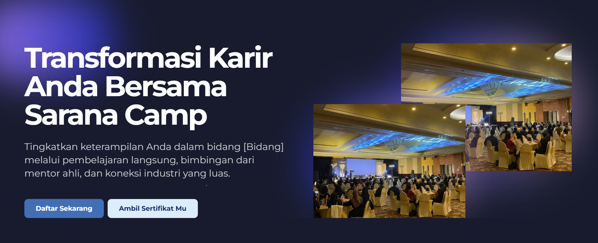

 
  

  

 
 
 

  

 

  
  <h2 align="center"></h2>

  
  
  
  
  

 

<h2 align="center" style="font-family: 'Bruno Ace SC', cursive;#0099ff, 0 0 20px color: rgb(11, 45, 183); letter-spacing: 3px;">
  ~ 💻 𝓡𝓪𝓴𝓱𝓪'𓼠ğ““ğ“®ğ“¿ 𝓛𝓸𝓾𝓷𝓰𝓮 💻 ~
</h2>

  

  

    <!-- Badges with Glow Effect -->
    
      
    
    
      
    
    
      
    

      

    

    

      <strong style="color: #00ccff; font-size: 1.3em;">Yo! 🚀</strong> I'm <strong style="color: #ff66b3; text-shadow: 0 0 8px #ff00ff;">Rakha Naufal Azzam</strong>, a 
      FULL-STACK WIZARD who turns 
      ☕ coffee → Next.js apps → $$$  

      

        • <strong style="color: #3178C6;">TypeScript</strong> like it's my native language 📜 
        • <strong style="color: #339933;">Node.js</strong> backends that <em style="color: #00ccff;">actually scale</em> 🌠
        • <strong style="color: #ff66b3;">UI/UX</strong> smoother than your mom's jazz playlist 🷠
        • <strong style="color: #ff0000;">Debugging</strong> at 3AM: "why tf this worked now?" 🤯 
      

       
      

        <em style="text-shadow: 0 0 5px #ff00ff;">"console.log('Another day, another PR')"</em> 💻🔥
      

    

  

 

 

  

###

 

 

✨ 𝓡𝓪𝓴𝓱𝓪'𝓼 𝓣𝓮𝓬𝓱 𝓢𝓽𝓪𝓬𝓴 ✨

  

 

  <!-- Frontend -->
  

    
    <h3 style="color: #00AAFF; margin: 5px 0;">Frontend</h3>
    
HTML5, CSS3, JavaScript, TypeScript

  

  <!-- Frameworks -->
  

    
    <h3 style="color: #7F5AB6; margin: 5px 0;">Frameworks</h3>
    
React, Next.js, Tailwind, Bootstrap

  

  <!-- Backend -->
  

    
    <h3 style="color: #339933; margin: 5px 0;">Backend</h3>
    
Node.js, Nest.js

  

  <!-- Tools -->
  

    
    <h3 style="color: #FF6B6B; margin: 5px 0;">Tools</h3>
    
Git, GitHub, VSCode, Figma

  

 

  

    
  

 

 
 
 

<h2 align="center" style="font-family: 'Bruno Ace SC', cursive;  letter-spacing: 3px;">
  ~ 💎 𝓡𝓪𝓴𝓱𝓪'𝓼 𝓟𝓻𝓸𝓳𝓮𝓬𝓽𝓼 💎 ~
</h2>

  <table style="
    width: 100%;
    max-width: 1200px;
    border-collapse: separate;
    border-spacing: 20px;
    margin: 0 auto;
  ">
    <thead>
      <tr>
        <th style="width: 30%; text-align: left; color: #0099ff; font-size: 1.2em;">Project</th>
        <th style="width: 45%; text-align: left; color: #0099ff; font-size: 1.2em;">Description</th>
        <th style="width: 25%; text-align: left; color: #0099ff; font-size: 1.2em;">Tech & Links</th>
      </tr>
    </thead>
    <tbody>
      <!-- Project 1 - Scholist -->
      <tr style="background: rgba(0,153,255,0.05); border-radius: 10px;">
        <td style="
          padding: 15px;
          vertical-align: top;
          border-radius: 10px 0 0 10px;
        ">
          <h3 style="
            color: #0066cc;
            margin: 0 0 10px 0;
            font-size: 1.1em;
          ">Scholist</h3>
          
        </td>
        <td style="
          padding: 15px;
          vertical-align: top;
        ">
          
A scholarship management system that parses blog content to identify deadlines, requirements, and application steps, then converts them into personalized checklist templates for students to track their application progress.

        </td>
        <td style="
          padding: 15px;
          vertical-align: top;
          border-radius: 0 10px 10px 0;
        ">
          

            
            
            
          

          

            🔜 Upcoming
          

        </td>
      </tr>
      <!-- Project 2 - Safari Pigura -->
      <tr style="background: rgba(0,153,255,0.05); border-radius: 10px;">
        <td style="
          padding: 15px;
          vertical-align: top;
          border-radius: 10px 0 0 10px;
        ">
          <h3 style="
            color: #0066cc;
            margin: 0 0 10px 0;
            font-size: 1.1em;
          ">Safari Pigura</h3>
          
        </td>
        <td style="
          padding: 15px;
          vertical-align: top;
        ">
          
Safari Pigura is an e-commerce platform for a woodcraft company specializing in handmade picture frames, wooden boxes, and ring displays. This digital showcase enables customers to browse and purchase artisanal wood products online.

        </td>
        <td style="
          padding: 15px;
          vertical-align: top;
          border-radius: 0 10px 10px 0;
        ">
          

            
            
            
          

          

            <a href="https://safari-pigura.vercel.app/" style="
              display: inline-block;
              background: #0099ff;
              color: white;
              padding: 3px 8px;
              border-radius: 4px;
              font-size: 0.8em;
              font-weight: 500;
              text-decoration: none;
            ">🌐 Live Demo</a>
          

        </td>
      </tr>
      <!-- Project 3 - Sarana Camp -->
      <tr style="background: rgba(0,153,255,0.05); border-radius: 10px;">
        <td style="
          padding: 15px;
          vertical-align: top;
          border-radius: 10px 0 0 10px;
        ">
          <h3 style="
            color: #0066cc;
            margin: 0 0 10px 0;
            font-size: 1.1em;
          ">Sarana Camp</h3>
          
        </td>
        <td style="
          padding: 15px;
          vertical-align: top;
        ">
          
As Front-End Developer, I built an interactive landing page featuring event CTAs, bootcamp schedules, and a digital certificate retrieval system — enhancing user engagement and streamlined access to credentials.

        </td>
        <td style="
          padding: 15px;
          vertical-align: top;
          border-radius: 0 10px 10px 0;
        ">
          

            
            
            
          

          

            <a href="https://bootcamp.sarana.ai" style="
              display: inline-block;
              background: #0099ff;
              color: white;
              padding: 3px 8px;
              border-radius: 4px;
              font-size: 0.8em;
              font-weight: 500;
              text-decoration: none;
            ">🌐 Live Demo</a>
          

        </td>
      </tr>
    </tbody>
  </table>

<h2 align="center">            ~ ᴍʏ ᴄᴏɴᴛʀɪʙᴜᴛɪᴏɴꜱ ɢᴀᴍᴇ🐍🎮 ~</h2>
  
 

  

  
<picture>
  <source media="(prefers-color-scheme: dark)" srcset="https://raw.githubusercontent.com/rakaa0-0/rakaa0-0/output/pacman-contribution-graph-dark.svg">
  <source media="(prefers-color-scheme: light)" srcset="https://raw.githubusercontent.com/rakaa0-0/rakaa0-0/output/pacman-contribution-graph.svg">
  
</picture>

###

###

<h2 align="center" style="font-family: 'Bruno Ace SC', cursive; color: #0099ff; letter-spacing: 2px;">
  📊 𝓖𝓲𝓽𝓗𝓾𝓫 𝓢𝓽𝓪𝓽𝓼 📊
</h2>

  

  <!-- Activity Graph -->
  

    
  

  <!-- Stats Row -->
  

    <!-- Stats Card -->
    

      
    

    <!-- Streak Card -->
    

      
    

  

  <!-- Profile Details -->
  

    
  

  

